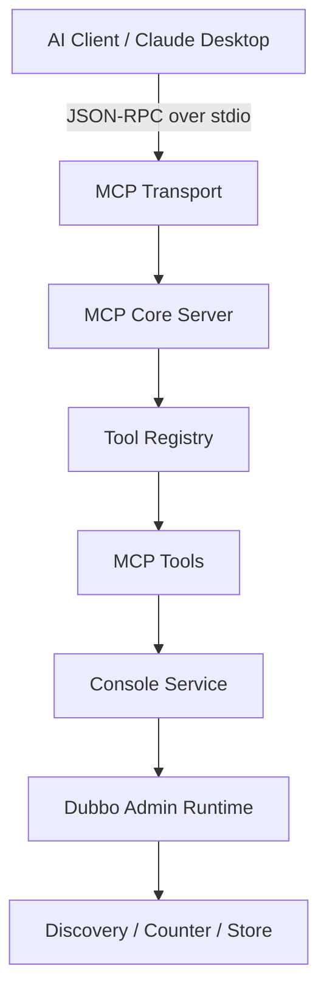
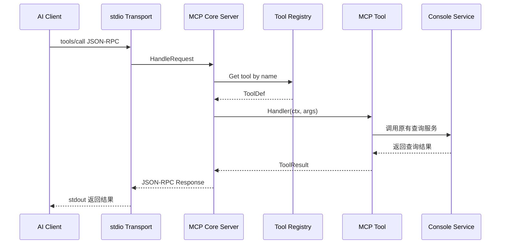
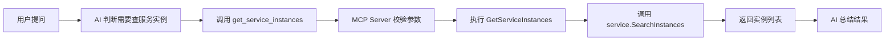

## 前言

以前我们排查 Dubbo 服务问题，通常要打开 Dubbo Admin 页面，手动搜索应用、服务、实例，再一层层点进去看详情。

引入 MCP 之后，Dubbo Admin 多了一种新的使用方式：**AI 助手可以像调用函数一样调用 Dubbo Admin 的查询能力**。比如你问：“帮我查一下订单服务有哪些实例”，AI 不再只能猜，而是可以通过 MCP 工具拿到真实的 Dubbo Admin 数据，再帮你总结。

这篇文章用新手能看懂的方式，讲清楚 Dubbo Admin MCP 的设计逻辑。

---

## 1. MCP 是什么

MCP 可以简单理解成：

> AI 助手和外部系统之间的一套标准接口。

Dubbo Admin MCP 做的事情，就是把 Admin 里的查询能力包装成一个个工具，例如：

- 查询集群概览；
- 搜索 Dubbo 服务；
- 查询服务详情；
- 查询应用详情；
- 查询实例列表和实例指标。

这样 AI 客户端就可以按统一协议调用这些工具。

---

## 2. 整体架构

Dubbo Admin MCP 不是重新写一套 Admin，而是在原有 Admin 能力外面加了一层 MCP 入口。



可以把它理解成：

```text
AI 提问
  ↓
MCP 收到工具调用
  ↓
找到对应 Tool
  ↓
Tool 调用 Dubbo Admin 原来的 service 层
  ↓
返回真实查询结果
  ↓
AI 再组织成人话回答
```

---

## 3. 启动入口：先启动 Admin Runtime，再启动 MCP

入口代码位于：

```text
cmd/mcp-server/main.go
```

关键逻辑可以简化成下面这样：

```go
cfg := app.DefaultAdminConfig()
config.Load(configPath, &cfg)

// MCP 模式不启动 Console HTTP 服务，避免端口冲突
cfg.Console = nil

rt, _ := bootstrap.Bootstrap(ctx, cfg)
go rt.Start(stopCh)

consoleCtx := consolectx.NewConsoleContext(rt)
server := core.NewServer(ServerName, ServerVersion)
```

这里有一个重要点：**MCP 进程仍然会启动 Dubbo Admin 的 runtime**。

因为真正的数据能力，比如服务发现、应用统计、实例信息、指标计数等，都在 Admin runtime 里。MCP 只是多开了一个 AI 可以调用的入口。

接着注册工具：

```go
reg := server.GetRegistry()
reg.RegisterRegistrar(&tools.MetricsRegistrar{})
reg.RegisterRegistrar(&tools.ResourceSearchRegistrar{})
reg.RegisterRegistrar(&tools.ServiceRegistrar{})
reg.RegisterRegistrar(&tools.DetailRegistrar{})
reg.RegisterAll()

server.SetConsoleContext(consoleCtx)
transport := stdio.NewTransport(server)
```

这段代码说明 MCP Server 启动后，会一次性注册多组工具，然后通过 stdio 和 AI 客户端通信。

---

## 4. Core Server：负责处理 MCP 请求

核心代码位于：

```text
pkg/mcp/core/server.go
```

它主要处理三类请求：

```go
switch req.Method {
case MethodInitialize:
    return s.handleInitialize(req)
case MethodToolsList:
    return s.handleToolsList(req)
case MethodToolsCall:
    return s.handleToolsCall(req)
default:
    return s.methodNotFoundResponse(req)
}
```

新手可以这样理解：

| MCP 方法 | 作用 |
|---|---|
| `initialize` | AI 客户端问：你是谁？你支持什么？ |
| `tools/list` | AI 客户端问：你有哪些工具？ |
| `tools/call` | AI 客户端调用某个具体工具 |

真正执行工具的是 `tools/call`：

```go
tool, ok := s.registry.Get(name)
if !ok {
    return s.newErrorResponse(req.ID, ErrCodeMethodNotFound, "Tool not found: "+name)
}

if err := ValidateRequired(tool.InputSchema, arguments); err != nil {
    return s.newErrorResponse(req.ID, ErrCodeInvalidParams, err.Error())
}

result, err := tool.Handler(s.consoleContext, arguments)
```

这段逻辑很关键：

1. 根据工具名从 Registry 找工具；
2. 校验必填参数；
3. 执行工具的 Handler；
4. Handler 内部再调用 Dubbo Admin 的 service 层。

---

## 5. Registry：工具注册表

工具注册表代码位于：

```text
pkg/mcp/registry/registry.go
```

它像一个“工具电话簿”：工具注册进去后，调用时就能按名字找到。

```go
type Registry struct {
    tools      map[string]types.ToolDef
    registrars []ToolRegistrar
}

func (r *Registry) Register(tool types.ToolDef) error {
    if tool.Name == "" {
        return fmt.Errorf("tool name cannot be empty")
    }
    r.tools[tool.Name] = tool
    return nil
}

func (r *Registry) Get(name string) (types.ToolDef, bool) {
    tool, exists := r.tools[name]
    return tool, exists
}
```

为什么要这样设计？

因为后续新增工具会很方便。比如以后要增加“路由规则查询工具”，只需要新增一个 Registrar，再把工具注册进去即可，不需要改核心协议层。

---

## 6. Tool：一个工具长什么样

工具定义位于：

```text
pkg/mcp/types/tool.go
```

一个工具主要包含四部分：

```go
type ToolDef struct {
    Name        string
    Description string
    InputSchema InputSchema
    Handler     ToolHandler
}
```

对应到人话就是：

| 字段 | 含义 |
|---|---|
| `Name` | 工具名，比如 `search_services` |
| `Description` | 告诉 AI 这个工具能干什么 |
| `InputSchema` | 告诉 AI 需要传哪些参数 |
| `Handler` | 真正执行查询逻辑的函数 |

例如服务查询工具会注册 `search_services` 和 `get_service_detail`：

```go
reg.Register(types.ToolDef{
    Name:        "search_services",
    Description: "搜索 Dubbo 服务，支持按服务名过滤和分页",
    InputSchema: types.InputSchema{Type: "object"},
    Handler:     SearchServices,
})
```

AI 客户端看到这个工具描述后，就知道：如果用户想搜索服务，可以调用 `search_services`。

---

## 7. 工具如何复用 Admin 原有能力

以搜索服务为例，工具 Handler 并没有重新实现一套服务查询逻辑，而是调用了 Admin 原来的 service 层：

```go
func SearchServices(ctx consolectx.Context, args map[string]any) (*types.ToolResult, error) {
    helper := NewArgsHelper(args)
    keywords := helper.GetString("keywords", "")
    mesh := GetMeshArg(ctx, args)

    req := &model.ServiceSearchReq{
        Keywords: keywords,
        Mesh:     mesh,
        PageReq:  BuildPageReq(pageNumber, pageSize),
    }

    result, err := service.SearchServices(ctx, req)
    if err != nil {
        return ErrorResult(err), nil
    }
    return buildServiceSearchResult(result, keywords, mesh, pageSize, pageNumber)
}
```

这里的重点是：

> MCP 工具只是包装层，真正查数据的还是 Dubbo Admin 原来的 `console/service`。

这样设计的好处是明显的：

- Web 控制台和 MCP 查询逻辑更容易保持一致；
- 不需要重复写服务发现、分页、详情查询逻辑；
- 后续维护成本更低。

---

## 8. stdio：AI 客户端怎么和 MCP Server 通信

传输层代码位于：

```text
pkg/mcp/transport/stdio/stdio.go
```

核心逻辑是：从标准输入读取一行 JSON 请求，交给 Core Server 处理，再把 JSON 响应写到标准输出。

```go
line, err := reader.ReadString('\n')

var req core.JSONRPCRequest
json.Unmarshal([]byte(line), &req)

resp := t.server.HandleRequest(&req)
respData, _ := json.Marshal(resp)

writer.Write(respData)
writer.WriteByte('\n')
writer.Flush()
```

所以在本地集成时，整体过程类似这样：



---

## 9. 当前工具能力概览

可以按用途把工具分成几类：

| 类型 | 代表工具 | 作用 |
|---|---|---|
| 集群概览 | `get_cluster_info` | 查询应用数、服务数、实例数、协议分布等 |
| 全局搜索 | `global_search` | 按关键字搜索应用、服务、实例等资源 |
| 服务查询 | `search_services`、`get_service_detail` | 搜索服务、查看服务分布 |
| 实例查询 | `get_service_instances`、`get_instance_detail` | 查看服务实例和实例详情 |
| 指标查询 | `get_instance_metrics` | 查询实例 qps、rt、成功率等指标 |
| 应用查询 | `get_application_detail`、`get_application_instances`、`get_application_services` | 查看应用详情、实例和服务 |

这些工具大多是查询类工具，更适合做巡检、排障、信息总结。

---

## 10. 一次真实调用是怎么走的

假设你问 AI：

```text
帮我查一下 com.foo.OrderService 有哪些实例。
```

调用链大致是：



对应的工具代码中，会把服务名作为关键字去搜索实例：

```go
req := &model.SearchInstanceReq{
    Keywords: serviceName,
    Mesh:     mesh,
    PageReq:  BuildPageReq(pageNumber, pageSize),
}

result, err := service.SearchInstances(ctx, req)
```

也就是说，AI 并不是“凭空回答”，而是通过工具拿到了 Admin 里的真实数据。

---

## 11. 设计亮点

### 1）协议层和业务层分离

`core` 只关心 MCP 协议，`tools` 才关心 Dubbo Admin 业务。这样结构比较清晰。

### 2）工具注册可扩展

新增工具时，不需要大改核心逻辑，只要定义新的 `ToolDef` 并注册进去。

### 3）复用原有 Admin service

MCP 没有绕开 Dubbo Admin 原来的查询能力，而是复用 `console/service`，这让结果更一致，也更容易维护。

### 4）适合 AI 排障场景

服务、实例、应用、指标这些信息，正好是排查微服务问题时最常用的数据。

---

## 总结

Dubbo Admin MCP 的核心设计可以总结成一句话：

> 把 Dubbo Admin 原有的查询能力包装成 MCP 工具，让 AI 助手可以按标准协议查询真实的 Dubbo 集群数据。

它的链路并不复杂：

```text
AI Client
  -> stdio Transport
  -> MCP Core Server
  -> Tool Registry
  -> MCP Tool Handler
  -> Dubbo Admin Console Service
  -> Runtime / Discovery / Counter
```

对于使用者来说，这意味着以后可以用更自然的方式和 Dubbo Admin 交互：

```text
当前集群有多少服务？
这个应用有哪些实例？
这个服务有哪些 Provider？
这个实例的指标是否正常？
```

AI 负责理解问题和组织答案，Dubbo Admin MCP 负责提供真实数据。两者结合后，Dubbo 集群的查询和排障体验会更加自然。

---

## 参考源码路径

```text
cmd/mcp-server/main.go
pkg/mcp/core/server.go
pkg/mcp/registry/registry.go
pkg/mcp/types/tool.go
pkg/mcp/transport/stdio/stdio.go
pkg/mcp/tools/metrics.go
pkg/mcp/tools/service_discovery.go
pkg/mcp/tools/detail_tools.go
```
