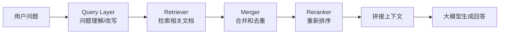
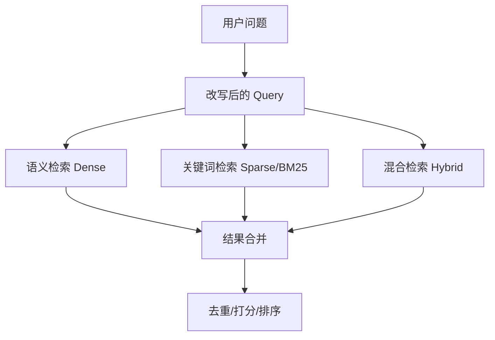

RAG，全称是 Retrieval-Augmented Generation，可以简单理解成：**大模型回答问题前，先去项目文档或知识库里查资料，再基于查到的内容回答**。

在 Dubbo Admin 的 AI 能力里，RAG 的作用就是让模型不要只靠“记忆”回答，而是能结合本地文档、服务说明、配置说明等上下文，给出更贴近项目实际的答案。

这次 RAG 架构的重点变化是：**把原来偏单一路径的检索流程，拆成了更清晰、可扩展的流水线**。

---

## 1. 整体流程

可以先看一张图：



简单说，就是：

> 用户提问后，系统不会马上把问题丢给大模型，而是先改写问题、检索资料、合并结果、重新排序，最后把最相关的内容交给模型回答。

---

## 2. RAG 被拆成了哪些组件？

核心结构体在 `ai/component/rag/rag.go` 中。简化后大概是这样：

```go
type RAG struct {
    // 文档处理
    Loader   document.Loader
    Splitter document.Transformer
    Indexer  indexer.Indexer

    // 单路检索，兼容旧逻辑
    Retriever retriever.Retriever

    // 多路检索
    RetrievalPaths []*RetrievalPath
    Merger         *mergers.MergeLayer

    // 问题理解
    QueryLayer *query.Layer

    // 结果重排
    Reranker rerankers.Reranker
}
```

对新手来说，可以把它理解成几个角色：

| 组件 | 作用 |
|---|---|
| `Loader` | 读取文档 |
| `Splitter` | 把长文档切成小块 |
| `Indexer` | 把文档块写入索引或向量库 |
| `Retriever` | 根据问题查相关文档 |
| `QueryLayer` | 对用户问题做改写、扩展 |
| `Merger` | 合并多路检索结果 |
| `Reranker` | 对候选结果重新排序 |

这就是重构后的核心思想：**每个环节都单独拆开，以后想替换某个能力时，不需要大改主流程**。

---

## 3. Query Layer：先把问题“翻译”成更适合检索的样子

用户的问题往往比较口语化，比如：

> provider 查不到是为什么？

但检索系统更喜欢明确的问题，比如：

> Dubbo Admin 中 provider 服务列表无法查询的原因，包括注册中心配置、服务发现和元数据同步问题。

所以新流程里加入了 `QueryLayer`。它的作用不是直接回答问题，而是先把问题处理得更适合后续检索。

核心流程在 `RetrieveV2` 里可以看到：

```go
func (r *RAG) RetrieveV2(ctx context.Context, req *RetrieveRequest) (*RetrieveResponse, error) {
    // 1. 问题理解和改写
    queryResult, err := r.processQuery(ctx, req)

    // 2. 检索相关文档
    rawResults, err := r.retrieveMultiPath(ctx, queryResult, req)

    // 3. 可选：对结果重新排序
    if r.Reranker != nil {
        rawResults, err = r.rerank(ctx, req.Query, rawResults, req.TopK)
    }

    // 4. 返回最终检索结果
    return &RetrieveResponse{
        Results: toRetrieveResults(rawResults),
    }, nil
}
```

这里能看出主链路非常清楚：

```text
问题处理 → 检索 → 重排 → 返回结果
```

---

## 4. 多路检索：不只从一个角度找资料

以前的检索更像是：

```text
用户问题 → 一个 Retriever → 返回文档
```

现在可以扩展成：



这就像找资料时，不只用一种搜索方式：

- 语义检索：找“意思相近”的内容；
- 关键词检索：找“词命中”的内容；
- 混合检索：结合语义和关键词。

在源码里，多路检索路径由 `RetrievalPath` 表示：

```go
type RetrievalPath struct {
    Label     string
    Retriever retriever.Retriever
    TopK      int
    Weight    float64
}
```

每条 path 都可以有自己的检索器、返回数量和权重。

---

## 5. Merger：把多路结果合并起来

如果几条检索路径都找到了结果，就会出现一个问题：

> 同一段文档可能被多条路径找到，应该怎么排序？

这就是 `Merger` 的作用。

它主要做三件事：

1. 合并多路结果；
2. 去掉重复内容；
3. 根据分数重新排序。

源码中的多路检索逻辑可以简化理解为：

```go
for _, path := range r.RetrievalPaths {
    docs, err := path.Retriever.Retrieve(ctx, query, retriever.WithTopK(pathTopK))
    allPaths = append(allPaths, &mergers.MultiPathResult{
        Label:   mergers.SourceLabel(path.Label),
        Results: docs,
        Weight:  path.Weight,
    })
}

merged, err := r.Merger.Merge(ctx, allPaths)
```

也就是说，每条检索路径先各自找资料，最后统一交给 `Merger` 做合并。

---

## 6. Reranker：最后再精排一次

Retriever 更像“粗筛”，Reranker 更像“精筛”。

比如检索器先找到了 20 段内容，但其中有些只是关键词相似，并不一定真正能回答问题。Reranker 会根据“用户问题 + 候选文档”再判断一次，把最相关的内容排到前面。

简化代码如下：

```go
reranked, err := r.Reranker.Rerank(ctx, query, docs, rerankers.WithTopN(topK))
```

这样做的好处是：**最终送给大模型的上下文更准确，回答质量也更稳定**。

---

## 7. 向量库存储：本地和 Milvus 都可以扩展

RAG 需要先把文档变成向量，再存起来。这样用户提问时，系统才能根据语义相似度找到相关内容。

重构后的设计把 `Indexer` 和 `Retriever` 抽象出来，因此底层可以接不同存储：

- 本地存储：适合开发、测试、小规模场景；
- Milvus / Zilliz Cloud：适合更大规模的向量检索；
- 其他向量库：后续也可以按同样方式接入。

这也是组件化设计的好处：**上层流程不关心数据到底存在哪里，只要底层实现了对应接口即可**。

---

## 8. 最终可以这样理解

这套 RAG 重构不是单纯“加了一个向量库”，而是把整个问答链路拆清楚了：

```text
文档准备阶段：
文档 → 加载 → 切分 → 向量化 → 建索引

用户提问阶段：
问题 → 改写 → 多路检索 → 合并去重 → 重排 → 大模型回答
```

核心价值有三个：

1. **更容易扩展**：想加新的向量库、新的检索方式、新的重排模型都更方便；
2. **检索质量更好**：问题改写、多路检索、重排能提升命中率；
3. **架构更清晰**：每个组件职责单一，后续维护成本更低。

一句话总结：

> Dubbo Admin 的 RAG 从“一个检索功能”，升级成了一套“可插拔、可扩展、可优化的检索增强流水线”。

